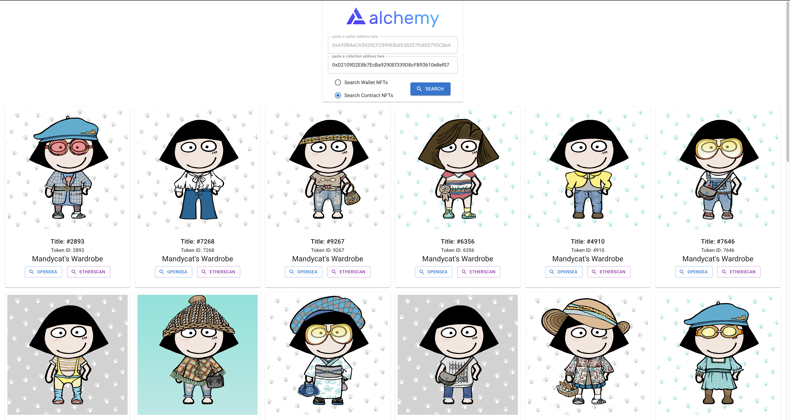

- This demo is based on a tutorial by [Vitto Rivabella](https://twitter.com/vittostack) from Alchemy.

- Vitto's tutorial can be found in [Alchemy](https://docs.alchemy.com/alchemy/road-to-web3/weekly-learning-challenges/4.-how-to-create-an-nft-gallery-alchemy-nft-api) & [YouTube](https://youtu.be/JzsTfOFjC1o).

- This project was bootstrapped with [Create React App](https://github.com/facebook/create-react-app).

- My wallet address : 0xA99B4eCA5929CF2999EBaf638357fc805795CBeA

- Mandycat's contract address : 0xD2109D2E8b7EcBa9290Ef339D8cFB93b10e8ef07

